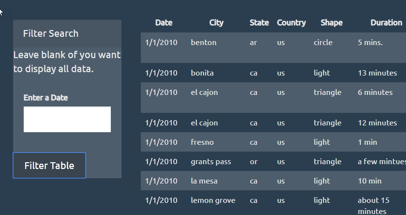
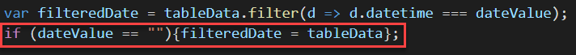
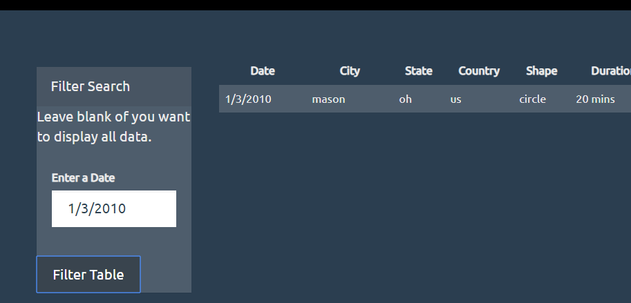
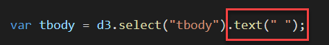
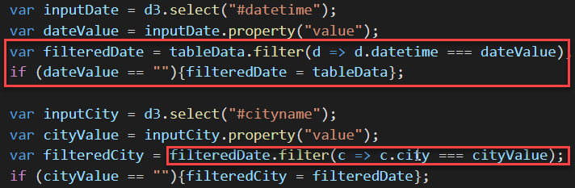
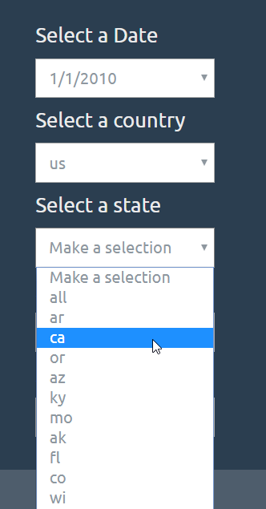

# hw11JavascriptChallenge

## Level 1.  

We need to filter out the data from data.js and append it on the table in the index.  The form is left blank, the script displays all the data. 

This is done by adding an if statement to replace the filtered table with an unfiltered one if the inputvalue equals blank. 
I needed to remove the place holder from the input tag in index.html for the unflitered to work. 

When a date is entered, it will clean out the currently displayed table and present the filtered table. 

This is done by adding:  

## Level 2

Level 2 is the same website but with multiple filters.  The filters are dependent on the previous filter.  Meaning, if dateValue has a date, then filter the data.  Then filter it further by city, then state, then so forth.  An if statement was added incase the user only wants to filter by city for example.  

## Level 3

I too it a step further and created dynamic drop downs to filter the data.  As with the level 2, since I wanted the drop downs to depend on what was selected prior, I had to makde them cascade.  

The menus are dynamic and are dependent on that is selected above.  Just like on www.autotrader.com 

To help minimize clutter, I created a separate file called functions.js.  Here is where I stored one of the functions.  I was going to attempt to turn the creation of the filtered data and the writing of the drop down menus to a function but I wasn't sure how to syntax it properly.  So I left it be since it is working perfectly right now.  I may go back to it later as I learn more techniques. 

## Issues: 
nasa.jpg was being called by the styles.css but the image file wasn't included in the homework.  So I just commented out the line in styles.css.  

## Others:

I tried not to use too many shortcuts in the code (i.e. arrow function) because it would be easier for me to understand it later on when I refer back to code.  
